# Project Canvas

## 1. Project Structure

```mermaid
graph TD
    root["/"]
    components["/components"]
    context["/context"]
    pages["/pages"]
    
    root --> App["App.tsx"]
    root --> index["index.tsx"]
    root --> config["vite.config.ts"]
    root --> types["types.ts"]
    root --> constants["constants.ts"]
    root --> indexCSS["index.css"]
    
    components --> Layout["Layout.tsx"]
    components --> Card["MedicineCard.tsx"]
    
    context --> CartCtx["CartContext.tsx"]
    
    pages --> Home["Home.tsx"]
    pages --> Products["Products.tsx"]
    pages --> Orders["Orders.tsx"]
    pages --> Cart["Cart.tsx"]
    pages --> Checkout["Checkout.tsx"]
    pages --> Login["Login.tsx"]
    pages --> Contact["Contact.tsx"]
    pages --> About["About.tsx"]
    pages --> Blog["Blog.tsx"]
    pages --> Careers["Careers.tsx"]
```



## 2. Agent Prompts

Use these prompts to guide AI assistants when working on this project.

### 🤖 Frontend Architect
**Role:** Expert React Developer
**Stack:** React 19, Vite, Tailwind CSS, Framer Motion, Lucide React
**Context:**
You are building **MediFind**, a pharmacy aggregator app with a specialized "Senior Mode" for elderly users.
**Rules:**
- **Styling:** Use Tailwind CSS utility classes. Avoid inline styles.
- **Animations:** Use `framer-motion` for smooth transitions (e.g., page loads, dropdowns).
- **Icons:** Use `lucide-react` for all icons.
- **Senior Mode:** Always respect the `SeniorModeContext`. When active, ensure fonts are larger (`text-lg` or `text-xl`) and contrast is high.
- **Routing:** Use `react-router-dom` v7.

### 🎨 UI/UX Specialist
**Role:** Interface Designer
**Focus:** Accessibility & Professionalism
**Instructions:**
- Design for trust and clarity.
- Use a color palette of Slate (neutral), Blue (primary), and Green (success/senior mode).
- Ensure all interactive elements have a minimum touch target of 44px (48px in Senior Mode).
- Use `Layout.tsx` as the main wrapper for all pages.

### 📝 Task: Add New Page
**Prompt Template:**
```text
Create a new page component called [PageName].tsx in the /pages directory.
1. Wrap the content in the <Layout> component.
2. Use the "container mx-auto px-4" class for the main content area.
3. Implement a responsive grid if displaying items.
4. Ensure text sizes adjust when the .senior-mode class is present on the body (handled by global CSS, but check for specific overrides).
```

### 🛠️ Task: Update Component
**Prompt Template:**
```text
Refactor [Component.tsx] to improve accessibility.
- Add aria-labels to all buttons.
- Ensure high contrast in Senior Mode.
- meaningful alt tags for images.
```
